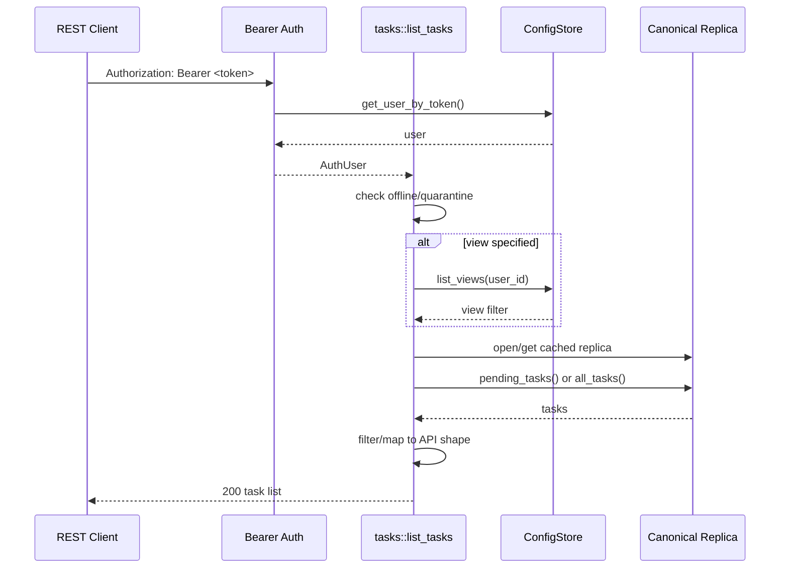
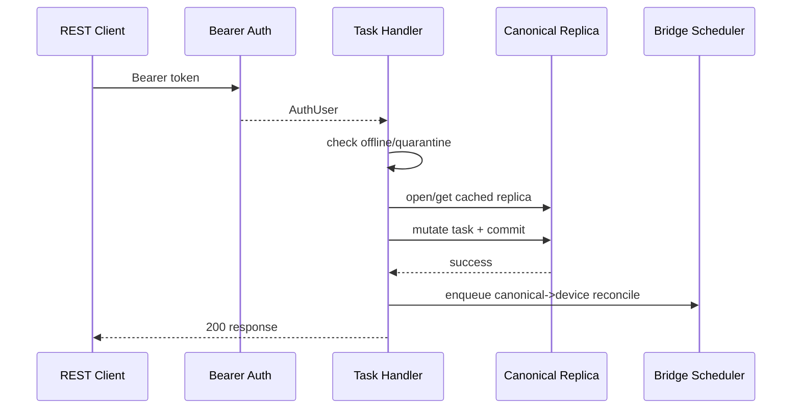
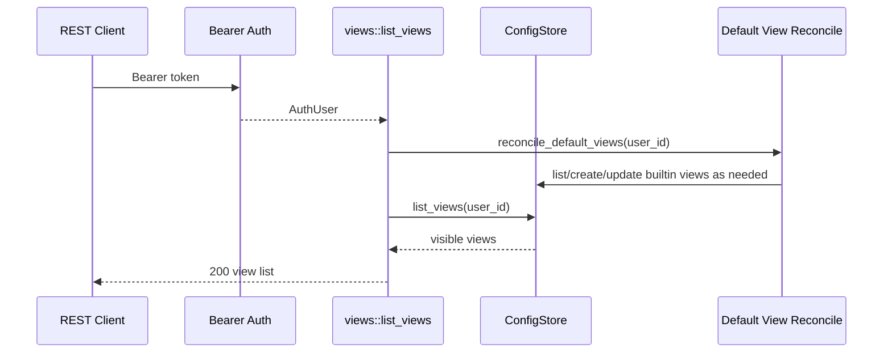
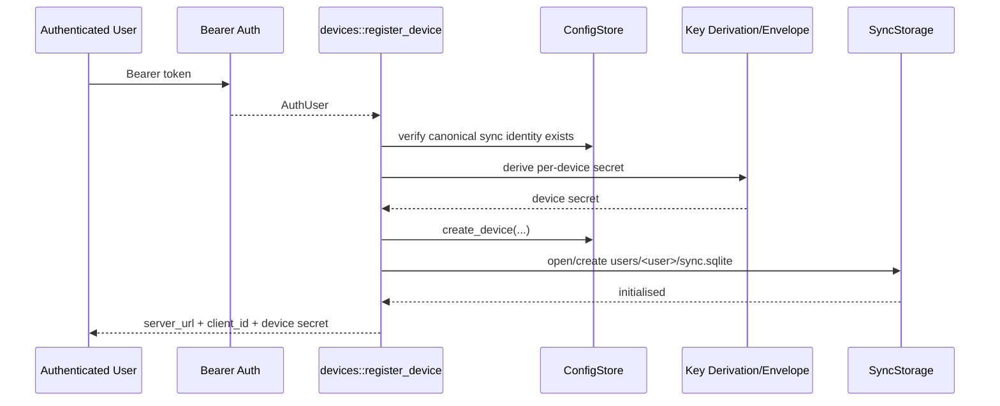
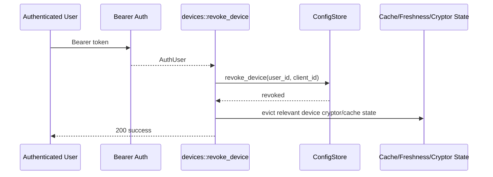
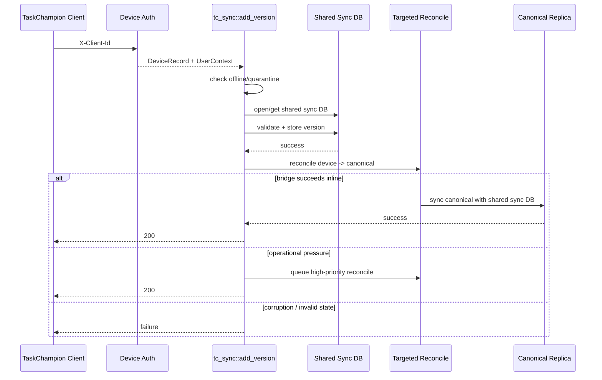
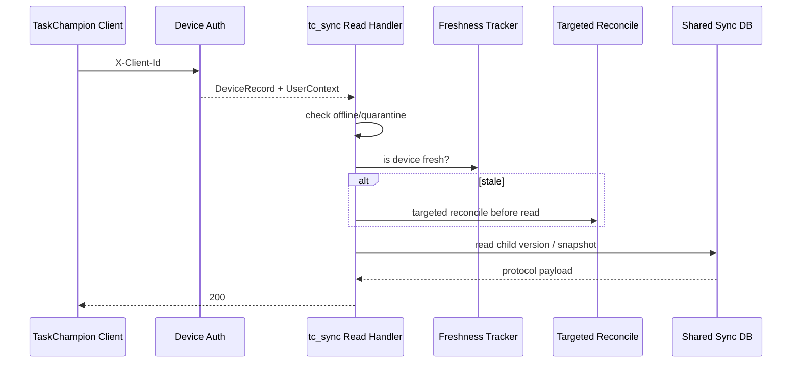
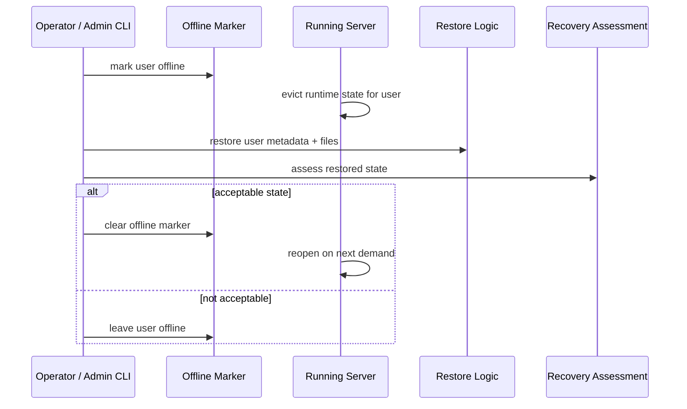

# API Interaction Flows Reference

This document explains the main request flows through `cmdock-server`.

It sits between:

- the endpoint inventory in [API Reference](../reference/api-reference.md)
- the deeper runtime model in [Concepts Guide](../manuals/concepts-guide.md)
- subsystem-specific detail such as [Sync Bridge Reference](sync-bridge-reference.md)

Use this when you want to answer questions like:

- what happens when a REST client lists tasks?
- what storage surfaces are touched by a REST write?
- when does the bridge run inline vs queued?
- what does device registration actually provision?

## Boundary Note

This document is a server-local flow reference.

It explains request and runtime sequences owned by `cmdock/server`. It is not
trying to document every possible product or deployment journey around the
server.

## 1. Reading This Document

Each flow includes:

- a sequence diagram
- the main storage surfaces touched
- important failure or retry behaviour

The diagrams are conceptual. They show the important interactions, not every
internal helper call.

## 2. REST Task List Flow

### `GET /api/tasks`

State touched:

- bearer token lookup in `config.sqlite`
- optional view lookup in `config.sqlite`
- canonical `taskchampion.sqlite3`

Important notes:

- REST reads use the canonical replica only
- REST reads do not synchronously force TaskChampion sync reconciliation first
- if the user is offline/quarantined, the flow fails fast with `503`

## 3. REST Task Mutation Flow

### `POST /api/tasks`
### `POST /api/tasks/{uuid}/done`
### `POST /api/tasks/{uuid}/undo`
### `POST /api/tasks/{uuid}/delete`
### `POST /api/tasks/{uuid}/modify`

State touched:

- bearer auth in `config.sqlite`
- canonical `taskchampion.sqlite3`
- bridge scheduler state in memory

Important notes:

- REST writes commit to canonical state first
- device reconciliation is normally queued, not forced inline
- this keeps bridge fan-out out of the normal REST latency path

## 4. View List / Reconcile Flow

### `GET /api/views`

State touched:

- `config.sqlite` only

Important notes:

- built-in views are lazily reconciled here
- this is one of the places where a read can still cause controlled metadata mutation

## 5. Device Registration Flow

### `POST /api/devices`

State touched:

- `config.sqlite`
- shared `sync.sqlite` on disk

Important notes:

- device provisioning is per physical client
- registration returns the real long-lived per-device sync credentials
- registration ensures the shared per-user sync DB exists if the user has not synced before

## 6. Device Revoke Flow

### `DELETE /api/devices/{client_id}`

State touched:

- `config.sqlite`
- in-memory device-related runtime state

Important notes:

- revoke is the normal removal path
- delete is destructive cleanup and is intentionally separate

## 7. TaskChampion Write Flow

### `POST /v1/client/add-version/{parent}`

State touched:

- device registry in `config.sqlite`
- shared `sync.sqlite`
- canonical replica
- bridge scheduler/freshness state

Important notes:

- TaskChampion writes hit the shared sync DB first
- targeted reconcile toward canonical may run inline
- operational pressure may degrade to queued bridge work rather than immediate protocol failure
- device-specific crypto still applies at the HTTP boundary even though on-disk sync state is shared per user

## 8. TaskChampion Read Flow

### `GET /v1/client/get-child-version/{parent}`
### `GET /v1/client/snapshot`

State touched:

- device registry in `config.sqlite`
- freshness tracker in memory
- shared `sync.sqlite`
- sometimes canonical replica via bridge

Important notes:

- reads are served from the shared sync DB, then translated for the requesting device
- targeted bridge work is skipped when the shared sync state is already known fresh for that device context

## 9. Online Selective Restore Flow

### `admin user offline`
### `admin restore --user-id`
### `admin user assess`
### `admin user online`

State touched:

- offline marker under `users/<user_id>/.offline`
- `config.sqlite`
- canonical replica files
- shared sync DB files
- runtime caches/freshness state

Important notes:

- selective restore is a coordinated state transition, not just a file copy
- future per-user metadata/schema uplift would fit between restore and assess

## 10. What This Reference Is Not

This document does not replace:

- the OpenAPI spec for exact request/response shape
- the Concepts Guide for mental model
- subsystem references for deep implementation details

It is intentionally about interaction flow and state touchpoints.
